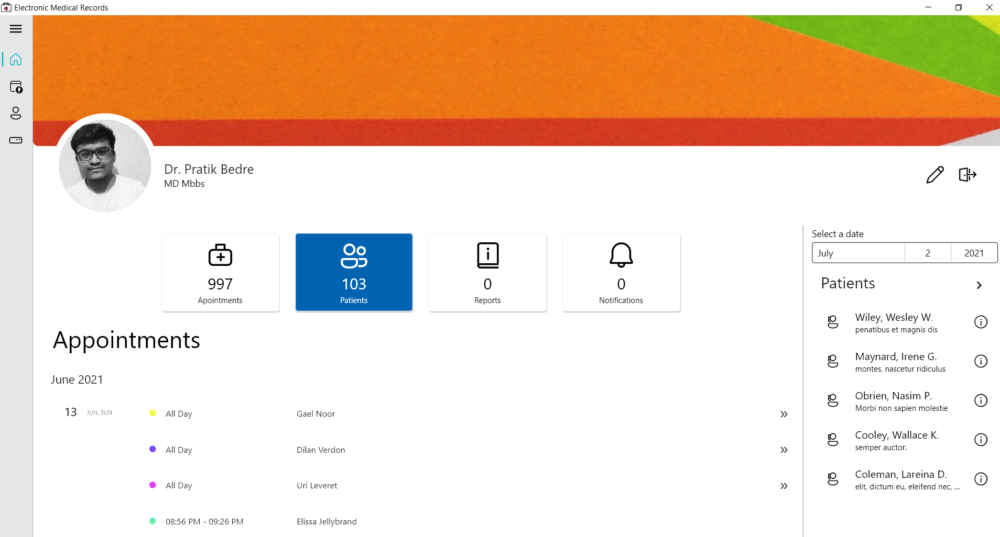
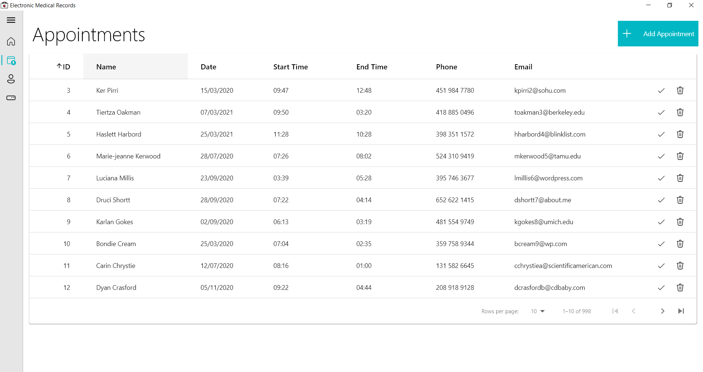
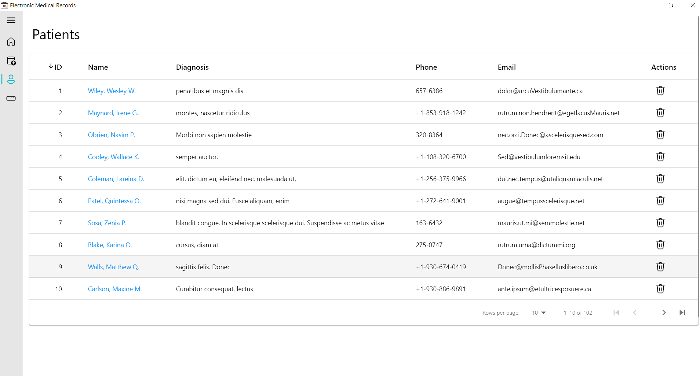
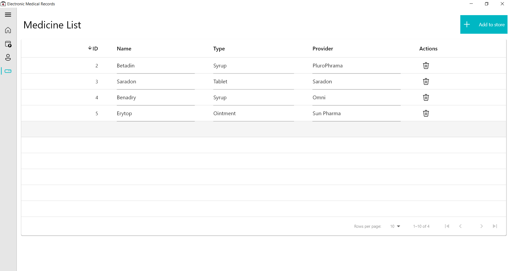

<p style="text-align: center; font-weight:bold; font-size:32px"> EMR Manager</p>


**EMR Manager** is a simple solution for managing medical records, patient information, appointments, etc. Created with Flutter, it can be installed on Windows, MacOS or Linux. It is simple, secure and robust. Add patients and appointments, manage medicine database, write and send prescriptions easily. It is secure as all the data is stored locally
<hr>

## Installation  
On windows, get the installer from  <a href="release/WindowsInstaller.msix" download>here</a>.

On Linux/MacOs, follow the steps : 
1. Install flutter from [here](https://flutter.dev/desktop).

2. Clone the repository.
   
   ```$ git clone https://github.com/pratikb2805/EMR.git```
3. Move into src directory and run 
   
   ```
   $ flutter build linux #for linux
   $ flutter build macos #for macos  
   ```
Note : On windows, if you get an error "Untrusted app", download the certificate from [here](certifcate.pfx) and follow the stpes mentioned in this [tutorial](https://www.advancedinstaller.com/install-test-certificate-from-msix.html)

<hr>

## Developed by 

- Prathamesh Wagh [@Prathamesh28](https://github.com/Prathamesh28)

- Pratik Bedre [@pratikb2805](https://github.com/pratikb2805)
<hr>

## Screenshots


Sign-In Screen 


<hr>

Dashboard


<hr>

Appointments' list 


<hr>
Patients' list 


<hr>

Medicines' list 



<hr>
PDF Prescriptions

<br>


<hr>

### Special thanks to 
[Bruno D'Luka](https://github.com/bdlukaa) for the beautiful `fluent_ui` package

<a title="Made with Fluent Design" href="https://github.com/bdlukaa/fluent_ui">
  
</a>

And all the flutter developers out there for  creating the awesome packages on [pub.dev](https://pub.dev)